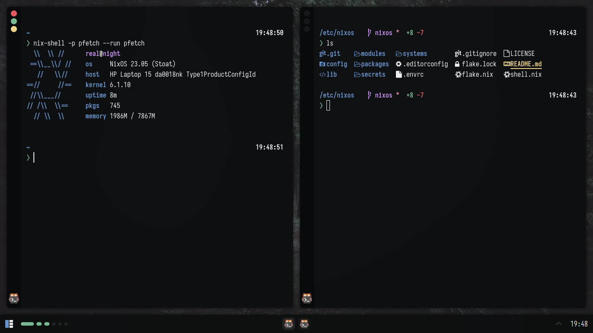

<h1 align=center>@real-fht dotfiles! (NixOS edition)</h1>

These are my dotfiles managed under a NixOS flake, with home-manager as the solution
to deploy configuration files and such to my user home directory.

